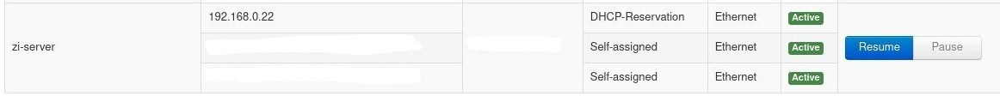
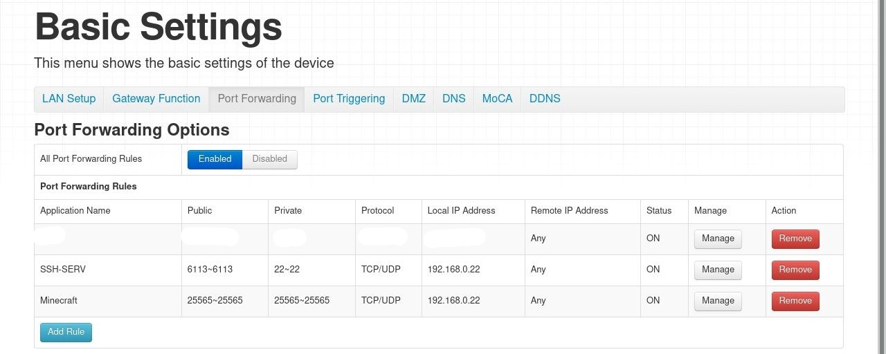
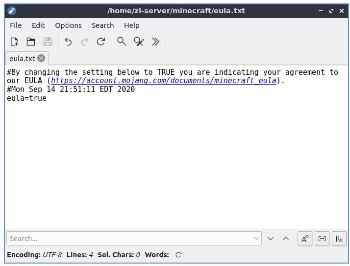

# [UPDATE 1.2 - Multi-World Support]
Puzzle is now able to support multiple worlds on the same ip and port. Keep in mind that only one world can be run simultaneously to avoid conflict. To save the currently running world, use option `6` to Create World. You can then give it a unique name to keep track. To switch to a world, use option `8`. A list of already named worlds will appear. Typing the world name will load it into the current world.

Option `7` allows for the deletion of worlds. 

Note that if a currently running world is not saved and option `8` is used to switch to an existing world, the current world will be deleted forever. Make sure to use option `6` beforehand.

# [UPDATE 1.1 - Paper Port]

Puzzle is now ported over to Paper instead of vanilla. The download for the Paper jar files can be found here: https://papermc.io/downloads

Paper contains significant performance improvements and has a much more stable tick rate.

# Puzzle 1.0 - Minecraft Server Administration
Simple Shell Scripting to backup, restore, and maintain a Minecraft server running on a Linux machine.


## Requirements
- A Linux machine for server administration
- An external machine to store the backups (we used a **Raspberry Pi 4**)  

Note: Do make sure both the Linux machine and external location have at least **128GB** of storage in order to keep up with the backups.

## How to Set-up
### (1) Setting-up an SVN Server
You're gonna have to figure this one out yourself, depending on what kind of computer you use to host the SVN server.

Check out this excellent tutorial if you're using the Raspberry Pi >> https://www.jeremymorgan.com/tutorials/raspberry-pi/raspberry-pi-how-to-svn-server/

Just make sure that your SVN repository follows this:
- The SVN repository is named, *Minecraft*.
- There is a folder in Minecraft named, *logs* (ie. Minecraft/logs).
- There is a folder in Minecraft named, *longterm_backup* (ie. Minecraft/longterm_backup).

### (2) Setting-up the Linux Machine
As mentioned before, a linux machine is recommended to host the Minecraft server. It is possible to do it on Windows instead, but it is much more resource intensive and the terminal is not as great. At the time of writing, we are using **Lubuntu 18.04**. However, any Ubuntu based installation should work.

After installing Lubuntu, type the following in terminal to receive the latest updates and packages:
```
sudo apt full-upgrade
```
You may require a system reboot after this step.

To install Java, type the following:
```
sudo apt install default-jdk
```
Note that technically, only the Java JRE is required to run the Minecraft server. However, since the JDK includes the JRE, we installed this instead.

The main method of connecting to the Linux machine will be through **SSH**. This only allows for one terminal to be active at one time. To bypass this, we will use **screen** to create an instance of a terminal for the Minecraft server to be run on. To install this, type:
```
sudo apt-get install screen
```

As mentioned before, we will be using SSH to connect to the server, instead of physically being there. We will have to install **openssh-server** on the Linux machine. Type:
```
sudo apt-get install openssh-server
```

To enable the service, type:
```
sudo systemctl enable ssh
```
followed by:
```
sudo systemctl start ssh
``` 
to start the service. The service will now autostart on every system reboot.

To check if the SSH is working, type `ssh localhost` and see if you can connect to your own machine. Type `exit` to exit the SSH session.

To install **SVN**, type:
```
sudo apt install subversion
```
Now we can clone the subversion repository into our local directory. First, make a folder named *minecraft* in your user directory. Namely, /home/$USERNAME/minecraft. Make sure that your current directory is /home/$USERNAME/minecraft in terminal before typing the next command.

Fetch the SVN repository by typing the following:
```
sudo svn checkout http://$IP:$SVN_PORT/svn/Minecraft
```
You will be asked for your user credentials. These are the SVN user credentials, not the login for the Linux machine.

### (3) Configuring the Network Settings
Open up your internet browser, and type `192.168.0.1` to log in to your router. The username and password will be specific to its model.
Reserve your linux machine's local ip address. This is called **DHCP-Reservation**. This ensures that you will be able to reliably connect to your server via SSH. In our case, the Linux machine's local ip is *192.168.0.22*.


Next, port forward your Linux server for both SSH and Minecraft. The default ports for those are 22 and 25565 respectively. In our case, we used 6113 for SSH.


### (4) Setting-up the Minecraft Server
Navigate to <https://www.minecraft.net/en-us/download/server> and download the latest **server.jar** file. At the time of writing, the current version of Minecraft is 1.16.3, so the jar file is named *minecraft_server.1.16.3.jar*. Place it in /home/$USERNAME/minecraft and rename it to *server.jar*.

Open a terminal in /home/$USERNAME/minecraft, and run the jar file with the following command:
```
java -Xmx1024M -Xms1024M -jar server.jar nogui
```
You should receive an error about agreeing to the EULA. This is normal. Open *eula.txt* and set:
```
eula=true
```


Now run the server again with the same command:
```
java -Xmx1024M -Xms1024M -jar server.jar nogui
```
This time, all the necessary server files will be created, and the world will be generated. Wait for everything to finish loading. After it's done, type `stop` to stop the server.

If you have a preexisting world, this is the time to insert it. Delete the *world* folder and replace it with your own. Make sure it's also named *world*, or else the server won't see it.

### (5) Setting-up Puzzle
Open up a terminal, and type the following to fetch the Puzzle files from this Github repository:
```
git clone https://github.com/KingLai23/Puzzle.git
```
Copy the following files into /home/$USERNAME/minecraft: 
* menu.sh
* server_backup.sh
* server_restore.sh
* set_crontab.sh
* start.sh
* stop.sh

In terminal, `cd` into the *minecraft* directory, and type 
```
chmod +x $FILENAME.sh
```
for all 6 of the afrementioned files. This is to make sure that all the files are executable. 

Open Puzzle by typing `sudo ./menu.sh`, and set the crontab by entering option **5**. A more detailed guide is described below.

## How to Use Puzzle
### Things To Consider Before Running Puzzle
Make sure these are in your minecraft folder:
- The Minecraft SVN repository checkout (should be named, *Minecraft*).
- server.jar, menu.sh, server_backup.sh, server_restore.sh, set_crontab.sh, start.sh, and stop.sh.
- All the files and folders created when generating a minecraft world.

Make sure you have Java installed on your Linux machine.

### Set Crontab
The Linux Cron Daemon is used to automatically backup the server. At a preset time, it will copy the *world* folder to the SVN repository and push it to the remote device.
To set the time, enter **5** in the main menu. Press **2** for the default time, which is 5am every day.
To set your own time, press any key.

There are 5 parameters for crontab. Namely,
```
minute
hour
day_of_month
month
day_of_week
```

For example, to set the backup to 4:30am every day, you would enter `30`, `4`, `*`, `*`, and `*`, in that order.


That's all, EASY.
