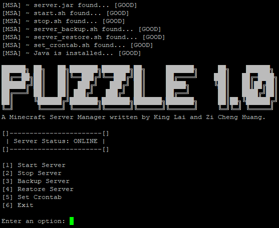

# Puzzle 1.0 - Minecraft Server Administration
Simple Shell Scripting to backup, restore, and maintain a Minecraft server running on a Linux machine.



## Requirements
- A Linux machine for server administration
- An external machine to store the backups (we used a **Raspberry Pi 4**)  

Note: Do make sure both the Linux machine and external location have at least **128GB** of storage in order to keep up with the backups.

## How to Set-up
### (1) Setting-up an SVN Server
You're gonna have to figure this one out yourself, depending on what kind of computer you use to host the SVN server.

Check out this excellent tutorial if you're using the Raspberry Pi >> https://www.jeremymorgan.com/tutorials/raspberry-pi/raspberry-pi-how-to-svn-server/

Just make sure that your SVN repository follows this:
- The SVN repository is named, *Minecraft*.
- There is a folder in Minecraft named, *logs* (ie. Minecraft/logs).
- There is a folder in Minecraft named, *longterm_backup* (ie. Minecraft/longterm_backup).

### (2) Setting-up the Linux Machine
As mentioned before, a linux machine is recommended to host the Minecraft server. It is possible to do it on Windows instead, but it is much more resource intensive and the terminal is not as great. At the time of writing, we are using **Lubuntu 18.04**. However, any Ubuntu based installation should work.

After installing Lubuntu, type the following in terminal to receive the latest updates and packages:
```
sudo apt full-upgrade
```
You may require a system reboot after this step.

To install Java, type the following:
```
sudo apt install default-jdk
```
Note that technically, only the Java JRE is required to run the Minecraft server. However, since the JDK includes the JRE, we installed this instead.

The main method of connecting to the Linux machine will be through **SSH**. This only allows for one terminal to be active at one time. To bypass this, we will use **screen** to create an instance of a terminal for the Minecraft server to be run on. To install this, type:
```
sudo apt-get install screen
```

As mentioned before, we will be using SSH to connect to the server, instead of physically being there. We will have to install **openssh-server** on the Linux machine. Type:
```
sudo apt-get install openssh-server
```

To enable the service, type:
```
sudo systemctl enable ssh
```
followed by:
```
sudo systemctl start ssh
``` 
to start the service. The service will now autostart on every system reboot.

To check if the SSH is working, type `ssh localhost` and see if you can connect to your own machine. Type `exit` to exit the SSH session.

To install **SVN**, type:
```
sudo apt install subversion
```

### (3) Configuring the Network Settings
Open up your internet browser, and type `192.168.0.1` to log in to your router. The username and password will be specific to its model.
Reserve your linux machine's local ip address. This is called **DHCP-Reservation**. This ensures that you will be able to reliably connect to your server via SSH. In our case, the Linux machine's local ip is *192.168.0.22*.
  

## How to Use Puzzle 
### Run The Main Menu
To run the main menu, go into the *minecraft* folder, and type the following:
```
sudo ./menu.sh
```

### Things To Consider Before Running The Main Menu
Make sure these are in your minecraft folder:
- The Minecraft SVN repository checkout (should be named, *Minecraft*).
- server.jar, menu.sh, server_backup.sh, server_restore.sh, set_crontab.sh, start.sh, and stop.sh.
- All the files and folders created when generating a minecraft world.

Make sure you have Java installed on your Linux machine.

That's all, EASY.
